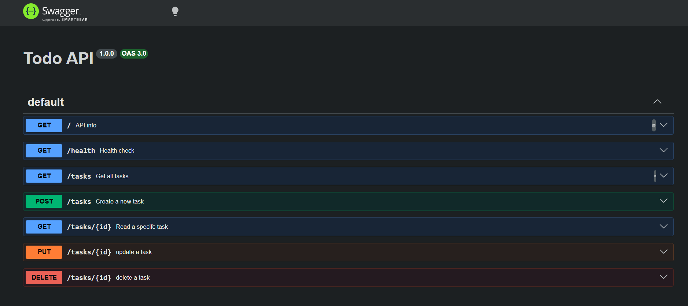

# Todo API

A simple RESTful Todo API built with Node.js, Express and PostgreSQL. It supports full CRUD operations (Create, Read, Update, Delete). The API is documented with Swagger (OpenAPI).

## Features

- Create tasks
- Read all tasks (sorted by title)
- Read a single task
- Update tasks (partial update)
- Delete tasks
- Filter tasks by done status
- Search tasks by title
- Task statistics
- Request validation
- Persistent PostgreSQL storage
- Swagger UI documentation

## Technologies

- Node.js
- Express.js
- PostgreSQL
- pg (node-postgres)
- dotenv
- Swagger UI
- swagger-jsdoc

## Database Setup

This API uses a PostgreSQL database. Create a database, then create a `.env` file in the project root with your credentials:

```bash
DB_HOST=localhost
DB_PORT=5432
DB_USER=your_user
DB_PASSWORD=your_password
DB_NAME=crud_api
```

On first start, the `tasks` table is created automatically and seeded with sample tasks if the table is empty.

## Installation

Clone the repository:

```bash
git clone https://github.com/YOUR_USERNAME/CRUD_API.git
```

Install dependencies:

```bash
npm install
```

Run the server:

```bash
node index.js
```

Or during development:

```bash
npx nodemon index.js
```

The server runs on:

```
http://localhost:3000
```

Swagger UI:

```
http://localhost:3000/docs
```

## API Endpoints

| Method | Endpoint   | Description                         |
| ------ | ---------- | ----------------------------------- |
| GET    | /          | API information                     |
| GET    | /health    | Health check                        |
| GET    | /stats     | Task statistics                     |
| GET    | /tasks     | Get tasks (filter by `done`, `search`) |
| GET    | /tasks/:id | Get a task by ID                    |
| POST   | /tasks     | Create a task                       |
| PUT    | /tasks/:id | Update a task (title and/or done)   |
| DELETE | /tasks/:id | Delete a task                       |

## Example cURL

Create a task:

```bash
curl -X POST http://localhost:3000/tasks \
-H "Content-Type: application/json" \
-d "{\"title\":\"Buy milk\"}"
```

Example response:

```json
{
  "id": 4,
  "title": "Buy milk",
  "done": false,
  "created_at": "2026-08-20T10:00:00.000Z",
  "updated_at": "2026-08-20T10:00:00.000Z"
}
```

Get pending tasks:

```bash
curl http://localhost:3000/tasks?done=false
```

Search tasks by title:

```bash
curl http://localhost:3000/tasks?search=express
```

Get task statistics:

```bash
curl http://localhost:3000/stats
```

Example response:

```json
{
  "total": 4,
  "done": 1,
  "pending": 3
}
```

Update a task (partial update):

```bash
curl -X PUT http://localhost:3000/tasks/4 \
-H "Content-Type: application/json" \
-d "{\"done\":true}"
```

## Swagger UI

Open:

```
http://localhost:3000/docs
```

Add your Swagger screenshot below.



## License

This project was created for learning purposes.
